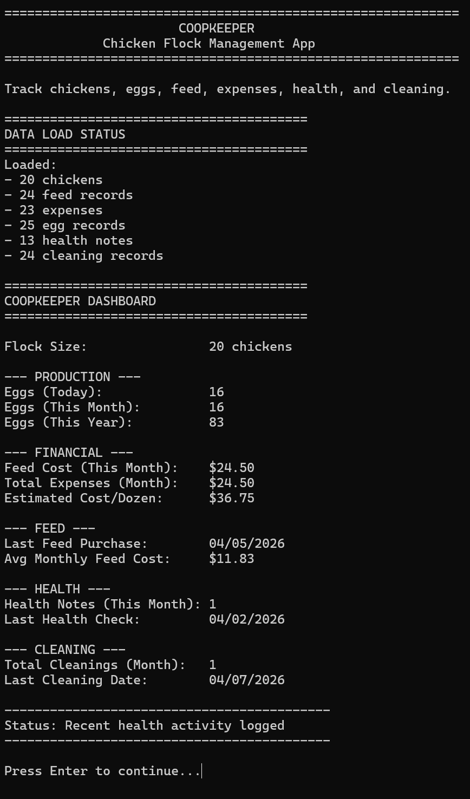

# 🐔 CoopKeeper CLI

A feature-rich **C++ command-line application** for managing backyard chickens, tracking egg production, monitoring costs, and maintaining coop health.

Built with real-world modeling, clean OOP design, and persistent data storage.

---

## 🚀 Features

### 📊 Smart Dashboard

* Eggs today, last 7 days, and current month
* Lay rate (%) with performance status:

  * Excellent / Good / Fair / Low
* Financial tracking:

  * Cost per egg
  * Cost per dozen
* Production insights:

  * Best production day
  * Monthly trend vs previous month
* Maintenance tracking:

  * Last cleaning date
  * Smart alerts (low production, overdue cleaning)

---

### 🥚 Egg Tracking

* Add, edit, delete egg records
* View all records (sorted chronologically)
* ✅ **NEW: View egg records by month**
* Realistic daily production tracking

---

### 🌽 Feed Tracking

* Track feed purchases and costs
* View full history
* ✅ **NEW: Filter feed records by month**

---

### 💰 Expense Tracking

* Log coop-related expenses
* Categorize spending
* Monthly summaries
* ✅ **NEW: View expenses by month**

---

### 🧹 Cleaning Records

* Track coop cleaning activity
* Monitor cleaning frequency
* ✅ **NEW: View cleaning records by month**

---

### 🩺 Health Notes

* Track chicken health issues
* Log observations per bird
* ✅ **NEW: View health notes by month**

---

## 🖼️ Screenshots

### Dashboard



### Egg Records


### Add Egg Entry


### CSV Export Confirmation


---

## 📁 Project Structure

```
CoopKeeper/
│
├── data/
│   ├── Chickens.txt
│   ├── EggRecords.txt
│   ├── FeedRecords.txt
│   ├── Expenses.txt
│   ├── CleaningRecords.txt
│   └── HealthNotes.txt
│
├── exports/
│   └── CSV exports generated here
│
├── screenshots/
│   └── UI screenshots for README
│
├── src/
│   ├── CoopTracker.cpp / .h
│   ├── Chicken.cpp / .h
│   ├── EggRecord.cpp / .h
│   ├── FeedRecord.cpp / .h
│   ├── Expense.cpp / .h
│   ├── HealthNote.cpp / .h
│   ├── CleaningRecord.cpp / .h
│   └── Utils.cpp / .h
│
└── main.cpp
```

---

## 📅 Data Format

All data is stored in pipe-delimited `.txt` files:

```
MM/DD/YYYY|field|field|...
```

### Example:

```
04/09/2026|17|Strong spring production
```

---

## 📈 Realistic Simulation

* 20-hen flock model
* Seasonal production changes:

  * Spring/Summer → peak production
  * Winter → reduced output
* Realistic feed + expense tracking
* Accurate cost-per-dozen calculations

---

## 💡 Example Output

```
Today's Lay Rate: 85.00% (17/20) - Excellent
Cost Per Dozen: $3.99
Best Day: 04/07/2026 (19 eggs)
Production Trend: [UP] +24.74%
```

---

## 🛠️ How to Run

1. Clone the repo:

```
git clone https://github.com/Holidazee/CoopKeeper-CLI.git
```

2. Open in Visual Studio 2022

3. Ensure required folders exist:

```
/data
/exports
/screenshots
```

4. Build and run

---

## 🧠 Concepts Demonstrated

* Object-Oriented Programming (OOP)
* File I/O (TXT + CSV export)
* Data parsing and validation
* Sorting and filtering
* Date-based querying (month/year filtering)
* Real-world data modeling

---

## 🔥 Future Improvements

* Profit tracking (egg sales)
* Per-chicken productivity tracking
* GUI version (Qt or web app)
* Graphs and analytics
* Mobile companion app

---

## 👨‍💻 Author

Taylor Burris

---

## ⭐ Support

If you like this project, consider starring the repo!
