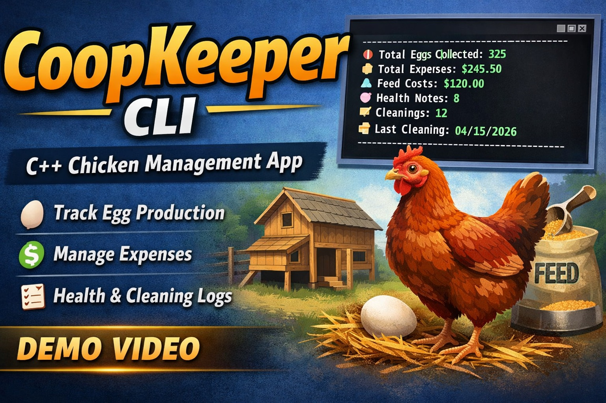

# 🐔 CoopKeeper CLI

A feature-rich C++ command-line application for managing backyard chickens, tracking egg production, analyzing costs, and monitoring coop operations.

Built with real-world data modeling, object-oriented design, and persistent storage.

---

## 🎬 Demo Video

Full walkthrough of CoopKeeper’s features and CLI interface:

[](https://www.youtube.com/watch?v=tT4yOsNMKbs)

---

## ⚡ Highlights

* 📊 Real-time egg production dashboard  
* 📅 Monthly filtering across all record types  
* 💰 Accurate cost-per-egg and cost-per-dozen calculations  
* 🐔 Realistic seasonal production modeling  
* 💾 Persistent storage using TXT + CSV export  

---

## 🚀 Features

### 📊 Smart Dashboard

* Eggs today, last 7 days, and current month  
* Lay rate (%) with performance status:
  * Excellent / Good / Fair / Low  
* Financial insights:
  * Cost per egg  
  * Cost per dozen  
* Production analytics:
  * Best production day  
  * Monthly trend vs previous month  
* Maintenance tracking:
  * Last cleaning date  
  * Smart alerts (low production, overdue cleaning)  

---

### 🥚 Egg Tracking

* Add, edit, delete egg records  
* Chronologically sorted records  
* Monthly filtering  
* Daily totals and production trends  

---

### 🌽 Feed Tracking

* Track feed purchases and costs  
* View full history  
* Monthly filtering  

---

### 💰 Expense Tracking

* Log coop-related expenses  
* Categorize spending  
* Monthly summaries  
* View expenses by month  

---

### 🧹 Cleaning Records

* Track coop cleaning activity  
* Monitor cleaning frequency  
* Monthly filtering  

---

### 🩺 Health Notes

* Track chicken health issues  
* Log observations per bird  
* Monthly filtering  

---

## 🖼️ Screenshots

### Dashboard


### Egg Records


### CSV Export Confirmation


---

## 📁 Project Structure

```
CoopKeeper/
│
├── data/
│   ├── Chickens.txt
│   ├── EggRecords.txt
│   ├── FeedRecords.txt
│   ├── Expenses.txt
│   ├── CleaningRecords.txt
│   └── HealthNotes.txt
│
├── exports/
│   └── CSV files generated here
│
├── screenshots/
│   ├── dashboard.png
│   ├── eggs.png
│   ├── export.png
│   └── thumbnail.png
│
├── src/
│   ├── CoopTracker.cpp / .h
│   ├── Chicken.cpp / .h
│   ├── EggRecord.cpp / .h
│   ├── FeedRecord.cpp / .h
│   ├── Expense.cpp / .h
│   ├── HealthNote.cpp / .h
│   ├── CleaningRecord.cpp / .h
│   └── Utils.cpp / .h
│
└── main.cpp
```

---

## 📅 Data Format

All data is stored in pipe-delimited `.txt` files:

```
MM/DD/YYYY|field|field|...
```

### Example

```
04/09/2026|17|Strong spring production
```

---

## 📈 Realistic Simulation

* 20-hen flock model  
* Seasonal production patterns:
  * Spring/Summer → peak production  
  * Winter → reduced output  
* Realistic feed and expense tracking  
* Accurate cost-per-dozen calculations  

---

## 💡 Example Output

```
Today's Lay Rate: 85.00% (17/20) - Excellent
Cost Per Dozen: $3.99
Best Day: 04/07/2026 (19 eggs)
Production Trend: [UP] +24.74%
```

---

## 🛠️ How to Run

1. Clone the repository:

```
git clone https://github.com/Holidazee/CoopKeeper-CLI.git
```

2. Open in Visual Studio 2022  

3. Ensure required folders exist:

```
/data
/exports
/screenshots
```

4. Build and run  

---

## 🧠 Concepts Demonstrated

* Object-Oriented Programming (OOP)  
* File I/O (TXT + CSV export)  
* Data parsing and validation  
* Sorting and filtering  
* Date-based querying (month/year filtering)  
* Real-world data modeling  

---

## 🔥 Future Improvements

* Profit tracking (egg sales)  
* Per-chicken productivity tracking  
* GUI version (Qt or web app)  
* Graphs and analytics  

---

## 👨‍💻 Author

**Taylor Burris**

---

## ⭐ Support

If you found this project helpful or interesting, consider starring the repo!
