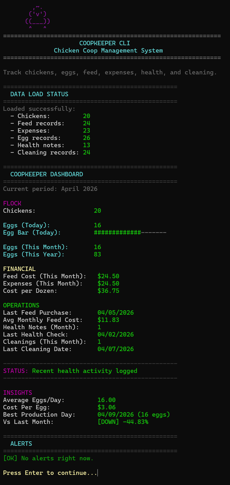
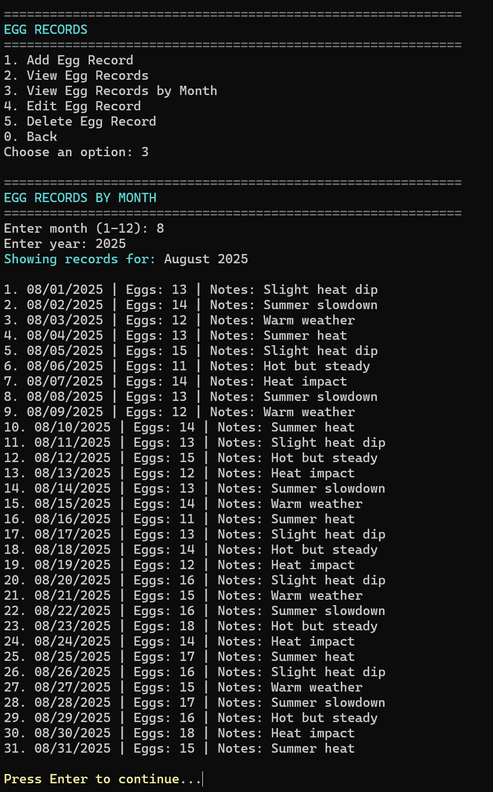
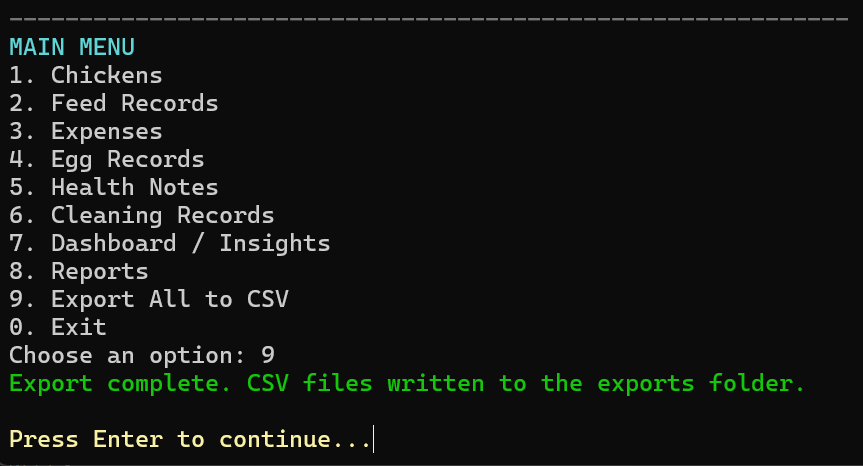

# 🐔 CoopKeeper-CLI

A C++ command-line application for managing backyard chicken coops — tracking egg production, feed, expenses, health, and cleaning with persistent storage and CSV export functionality.

---

## 📸 Preview

### Dashboard


### Egg Records


### CSV Export


---

## 🚀 Overview

CoopKeeper-CLI is a C++ menu-driven application designed to help chicken owners track and manage all aspects of their flock in one place.

It provides a clean, structured interface for recording daily activity while maintaining persistent data across sessions.

---

## ✨ Features

### 📊 Dashboard
- Flock size overview
- Daily, monthly, and yearly egg production
- Feed cost tracking
- Monthly expenses
- Cost per dozen eggs
- Health activity summary
- Cleaning records with last cleaning date

---

### 🥚 Egg Tracking
- Add, view, edit, and delete records
- Chronological sorting (oldest → newest)
- Monthly filtering
- Notes for each entry

---

### 💰 Expense Management
- Categorized expense tracking
- Monthly totals
- Cost analysis integration

---

### 🌾 Feed Tracking
- Track feed purchases and costs
- Monthly averages

---

### 🩺 Health Notes
- Log health observations and issues
- Track recent activity

---

### 🧼 Cleaning Records
- Record coop cleanings
- Dashboard visibility for last cleaning date

---

### 📤 CSV Export
- Export all data to CSV files
- Compatible with Excel and external analysis tools

---

## 🧱 Tech Stack

- C++ (C++17)
- Standard Template Library (STL)
- File I/O (TXT persistence)
- CSV export functionality
- Object-Oriented Programming (OOP)

---

## 📁 Project Structure

```
CoopKeeper-CLI/
│
├── data/              # Persistent TXT data storage
├── exports/           # Generated CSV files
├── screenshots/       # README preview images
│
├── include/           # Header files
├── src/               # Implementation files
│
├── README.md
├── LICENSE.txt
└── CoopKeeper.vcxproj
```

---

## ⚙️ Getting Started

### 1. Clone the repository
```bash
git clone https://github.com/Holidazee/CoopKeeper-CLI.git
```

### 2. Open in Visual Studio 2022

### 3. Setup required folders

Ensure the following directories exist in your build output folder:

```
x64/Debug/data/
x64/Debug/exports/
```

These are required for proper file loading and saving.

---

### 4. Build and Run

Press **F5** in Visual Studio or run the executable.

---

## 🧾 Example Data Format

**eggs.txt**
```
2026-04-01,12,Strong production
2026-04-02,10,Cool morning
```

Format:
```
DATE,VALUE,NOTES
```

---

## 🧠 What This Project Demonstrates

- Real-world problem solving
- Persistent data management using file systems
- Clean object-oriented design
- CLI user interface design
- Modular and scalable architecture
- Data processing and reporting

---

## 🔧 Challenges Solved

- Reliable file loading and saving across directories
- Maintaining sorted and indexed data consistency
- Implementing CSV export alongside TXT persistence
- Designing a clean and usable CLI dashboard
- Structuring a multi-module C++ application

---

## 🔮 Future Improvements

- GUI version (Qt or web-based dashboard)
- SQLite or database integration
- Data visualization (charts/graphs)
- Multi-coop support
- Mobile companion app

---

## 👨‍💻 Author

Taylor Burris  
https://github.com/Holidazee

---

## 📜 License

MIT License
